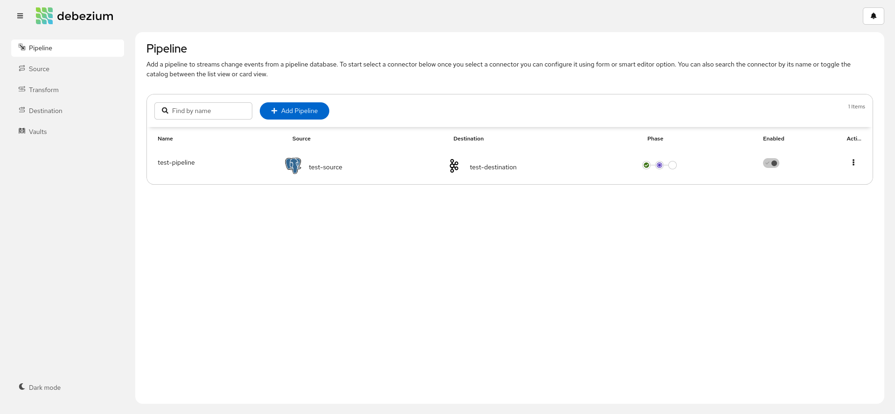

# Debezium Management Platform 

Debezium Management Platform (Debezium Orchestra) aims to provide means to simplify the deployment of 
Debezium to various environments in highly opinionated manner. The goal is not to provide 
total control over environment specific configuration. To achieve this goal the platform uses
a data-centric view on Debezium components.

**Disclaimer**: This project is still in early development stage and should not be used in production.

## Platform Architecture
The platform is composed of two main components:

1. Conductor: The back-end component which provides a set of APIs to orchestrate and control Debezium deployments.
2. Stage: The front-end component which provides a user interface to interact with the Conductor.


### Conductor Architecture
The conductor component itself is composed of several subcomponents:

1. API Server: The main entry point for the platform. It provides a set of APIs to interact with the platform.
2. Watcher: Component responsible for the actual communication with deployment environment (e.g. Debezium Operator in K8s cluster). 


## Installation

You can install the platform through helm chart. For instructions refer to the [README](helm/README.md)

## Run the example

If you don't have already a Kubernetes cluster up, you can use one of the commons tools to have a local K8s cluster

* [minikube](https://minikube.sigs.k8s.io/docs/) 
* [kind](https://kind.sigs.k8s.io/)

The prerequisite is to install an ingress controller. 

For this example, considering a local setup, we will use the `/etc/hosts` to resolve the domain.

The following script will map the K8s IP to the specified domain into the `/etc/hosts`.

```shell
export DEBEZIUM_PLATFORM_DOMAIN=platform.debezium.io
./examples/update_hosts.sh
```

Create a dedicated namespace

```shell
kubectl create ns debezium-platform
```

and then install *debezium-platform* through `helm`

```shell
cd helm && 
helm dependency build &&
helm install debezium-platform . -f ../example.yaml &&
cd ..
```

after all pods are running you should access the platform UI from `http://platform.debezium.io/`

To finish the example we will create a PostgreSQL, that will be used as source database,
and a kafka cluster, used as destination in our example pipeline.

```shell
# Deploy the source database

kubectl create -f examples/compose-kind-kafka/k8s/database/001_postgresql.yml
```

```shell
# Deploy the kafka cluster

kubectl create -f examples/compose-kind-kafka/k8s/kafka/001_kafka.yml
```

```shell
# Create a test pipeline

./examples/seed.sh platform.debezium.io 80 helm/payloads/
```

And that's all. 



You should have a test pipeline configured to move data from PostgreSQL to Kakfa.


