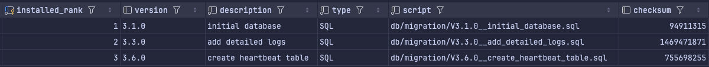

# Database migrations

This directory contains Flyway SQL migrations for the conductor database.

## Migration type

We use Flyway versioned migrations. They are applied once, in version order, and Flyway records their checksums in the database schema history table.



For more background on Flyway migration naming and why the naming pattern matters, see:

<https://www.red-gate.com/blog/flyway-naming-patterns-matter/>

## Naming convention

Migration files must follow Flyway's versioned migration naming format: 
```text
V<version>__<description>.sql
```

Examples:
```text
V3.1.0__initial_database.sql
V3.3.0__add_detailed_logs.sql
```

The migration version is mainly aligned with the current Debezium iteration/release version.

For example, migrations introduced during the `3.6.0` development iteration should generally start with:
```text
V3.6.0__<description>.sql
```

If multiple database changes are needed within the same Debezium version, use a fourth numeric segment as an incremental migration number:
```text
V3.6.0.1__first_additional_change.sql
V3.6.0.2__second_additional_change.sql
V3.6.0.3__third_additional_change.sql
```
The version determines the order in which Flyway applies migrations. The description should briefly explain what the migration does, using lowercase words separated by underscores.

## Do not modify applied migrations

Once a migration has been applied to any shared, test, staging, or production database, do not edit it.

Flyway stores a checksum for each applied migration in the database schema history table. If the contents of an already-applied migration file change, Flyway validation will fail on startup because the checksum no longer matches.

Instead, create a new migration with the next version number.

For example, if this migration has already been applied: 

```text
V3.6.0__create_heartbeat_table.sql
```
do not append new SQL to it. Create a new migration instead, such as:
```text
V3.6.0.1__fix_connection_sequence_increment.sql
```

If `V3.6.0.1` has also already been applied, use the next available version, for example:
```text
V3.6.0.2__fix_connection_sequence_empty_table.sql
```